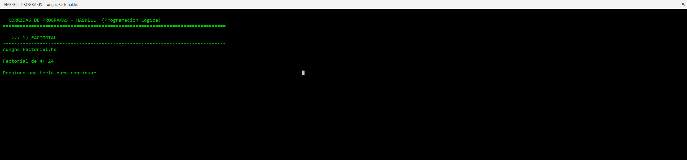
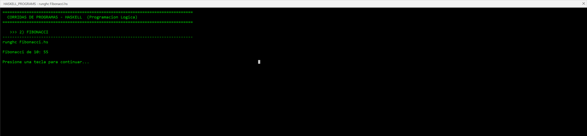
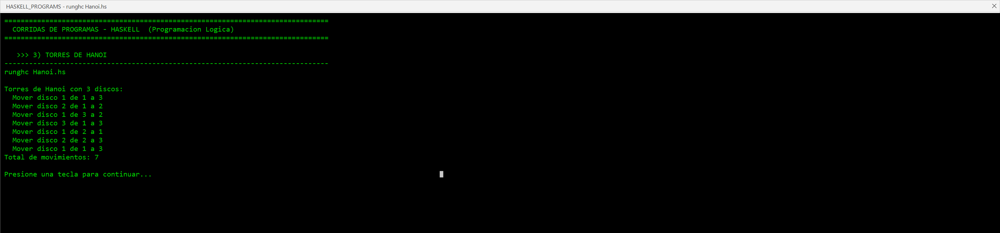
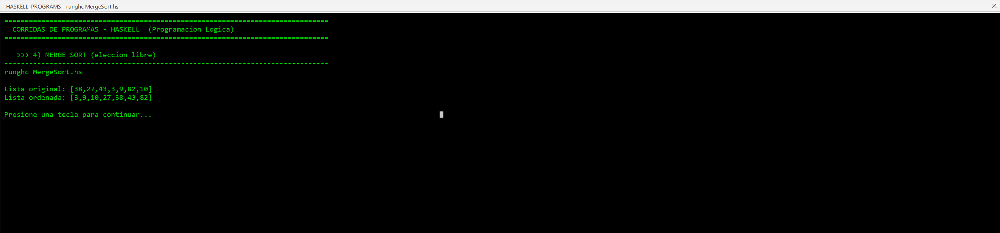

# Códigos: TypeScript vs Haskell 

## 1. Factorial

### TypeScript (Funcional)
```typescript
const declarativeFactory = (number: number) => {
  const numberList = Array.from({ length: number }, (_, i) => i + 1);
  return numberList.reduce((acc, curr) => acc * curr, 1);
};

const recursiveFactory = (number: number): number => {
  if (number === 0 || number === 1) {
    return 1;
  }
  return number * recursiveFactory(number - 1);
};
```

### Haskell
```haskell
factorial :: Integer -> Integer
factorial 0 = 1
factorial n = n * factorial (n - 1)
```

### Comparacion
| Aspecto | TypeScript | Haskell |
|---------|-----------|---------|
| Lineas de codigo | 10-13 | 2 |
| Sintaxis de casos base | `if` explicito | Pattern matching |
| Mutabilidad | Variable `acc` en reduce | Ninguna |
| Tipo de retorno | Inferido o anotado | Siempre anotado |

---

## 2. Fibonacci

### TypeScript (Funcional)
```typescript
const declarativeFibonacci = (number: number) => {
  return [...Array(number)].reduce(([a, b]) => [b, a + b], [0, 1])[0];
};

const recursiveFibonacci = (number: number): number => {
  if (number === 0) return 0;
  if (number === 1) return 1;
  return recursiveFibonacci(number - 1) + recursiveFibonacci(number - 2);
};
```

### Haskell
```haskell
fibonacci :: Int -> Integer
fibonacci 0 = 0
fibonacci 1 = 1
fibonacci n = fibonacci (n - 1) + fibonacci (n - 2)
```

### Comparacion
| Aspecto | TypeScript | Haskell |
|---------|-----------|---------|
| Casos base | `if` con `return` | Pattern matching |
| Legibilidad | Similar | Mas clara |
| Mutual recursion | No aplica | No aplica |
| Stack overflow | Ambos lo tienen | Ambos lo tienen |

---

## 3. Torres de Hanoi

### TypeScript (Funcional)
```typescript
type Movimiento = { desde: number; hacia: number; disco: number };

export function hanoiRecursivo(
  n: number,
  desde = 1,
  hacia = 3,
  aux = 2,
): Movimiento[] {
  const movimientos: Movimiento[] = [];
  const resolver = (discos: number, a: number, b: number, c: number): void => {
    if (discos === 0) return;
    resolver(discos - 1, a, c, b);
    movimientos.push({ desde: a, hacia: b, disco: discos });
    resolver(discos - 1, c, b, a);
  };
  resolver(n, desde, hacia, aux);
  return movimientos;
}
```

### Haskell
```haskell
type Movimiento = (Int, Int, Int)

hanoi :: Int -> Int -> Int -> Int -> [Movimiento]
hanoi 0 _ _ _ = []
hanoi n desde hacia aux =
  hanoi (n - 1) desde aux hacia ++ [(n, desde, hacia)] ++ hanoi (n - 1) aux hacia desde
```

### Comparacion
| Aspecto | TypeScript | Haskell |
|---------|-----------|---------|
| Estado mutable | Array `movimientos` mutado | Lista inmutable con `++` |
| Estructura de datos | Objeto con campos | Tupla |
| Concision | 15 lineas | 4 lineas |
| Eficiencia | O(2^n) push operations | O(2^n) concatenaciones |

---

## 4. Merge Sort (Eleccion Libre)

### TypeScript (Funcional)
```typescript
const mergeSort = <T>(arr: T[]): T[] => {
  if (arr.length <= 1) return arr;
  const mid = Math.floor(arr.length / 2);
  const left = mergeSort(arr.slice(0, mid));
  const right = mergeSort(arr.slice(mid));
  return merge(left, right);
};

const merge = <T>(left: T[], right: T[]): T[] => {
  if (left.length === 0) return right;
  if (right.length === 0) return left;
  if (left[0] <= right[0]) {
    return [left[0], ...merge(left.slice(1), right)];
  }
  return [right[0], ...merge(left, right.slice(1))];
};
```

### Haskell
```haskell
mergeSort :: Ord a => [a] -> [a]
mergeSort [] = []
mergeSort [x] = [x]
mergeSort xs = merge (mergeSort left) (mergeSort right)
  where
    (left, right) = splitAt (length xs `div` 2) xs

merge :: Ord a => [a] -> [a] -> [a]
merge [] ys = ys
merge xs [] = xs
merge (x:xs) (y:ys)
  | x <= y    = x : merge xs (y:ys)
  | otherwise = y : merge (x:xs) ys
```

### Comparacion
| Aspecto | TypeScript | Haskell |
|---------|-----------|---------|
| Polimorfismo | Genericos `<T>` | Contexto `Ord a =>` |
| Pattern matching | `if`/`else` | Guardas y patrones |
| Separacion de listas | `slice` | `splitAt` |
| Cons | Spread `...` | Constructor `:` |

---

## Resumen General

| Aspecto | TypeScript | Haskell |
|---------|-----------|---------|
| **Paradigma** | Multi-paradigma | Funcional puro |
| **Mutabilidad** | Permitida (evitable) | Prohibida |
| **Pattern matching** | Limitado | Nativo y poderoso |
| **Anotacion de tipos** | Opcional | Obligatoria |
| **Verbosidad** | Mayor | Menor |
| **Currying** | No nativo | Automatico |
| **Listas por comprension** | No nativo | Nativo |

---

## Glosario de Instrucciones de Haskell

| #   | Instruccion        | Descripcion                                                      | Ejemplo                                                |
| --- | ------------------ | ---------------------------------------------------------------- | ------------------------------------------------------ |
| 1   | `pattern matching` | Define funciones por patrones de entrada en lugar de condiciones | `factorial 0 = 1`                                      |
| 2   | `::`               | Anota el tipo de una funcion o valor                             | `factorial :: Integer -> Integer`                      |
| 3   | `where`            | Define definiciones locales visibles dentro de la funcion        | `mergeSort xs = ... where (left, right) = splitAt ...` |
| 4   | `++`               | Concatenacion de dos listas                                      | `[1,2] ++ [3,4]` = `[1,2,3,4]`                         |
| 5   | `:` (cons)         | Agrega un elemento al inicio de una lista                        | `1 : [2,3]` = `[1,2,3]`                                |
| 6   | `head`             | Obtiene el primer elemento de una lista                          | `head [1,2,3]` = `1`                                   |
| 7   | `tail`             | Elimina el primer elemento de una lista                          | `tail [1,2,3]` = `[2,3]`                               |
| 8   | `length`           | Devuelve el numero de elementos de una lista                     | `length [1,2,3]` = `3`                                 |
| 9   | `div`              | Division entera                                                  | `7 div 2` = `3`                                        |
| 10  | `mod`              | Residuo de la division                                           | `7 mod 2` = `1`                                        |
| 11  | `map`              | Aplica una funcion a cada elemento de una lista                  | `map (*2) [1,2,3]` = `[2,4,6]`                         |
| 12  | `filter`           | Filtra elementos segun una condicion                             | `filter even [1,4,7,10]` = `[4,10]`                    |
| 13  | `zipWith`          | Aplica una funcion a dos listas elemento a elemento              | `zipWith (+) [1,2] [3,4]` = `[4,6]`                    |
| 14  | `splitAt`          | Divide una lista en dos en la posicion indicada                  | `splitAt 2 [1,2,3,4]` = `([1,2],[3,4])`                |
| 15  | `show`             | Convierte un valor en String                                     | `show 42` = `"42"`                                     |
| 16  | `putStrLn`         | Imprime una cadena con salto de linea                            | `putStrLn "Hola"`                                      |
| 17  | `let`              | Enlaza un nombre a un valor en expresiones                       | `let x = 5 in x * 2`                                   |
| 18  | guards (`\|`)      | Ramifica segun condiciones booleanas                             | `f x \| x > 0 = x \| otherwise = 0`                    |

---

## Anexo: Capturas de Ejecucion

Capturas del codigo Haskell ejecutado con `runghc` (directorio `capturas/`).








